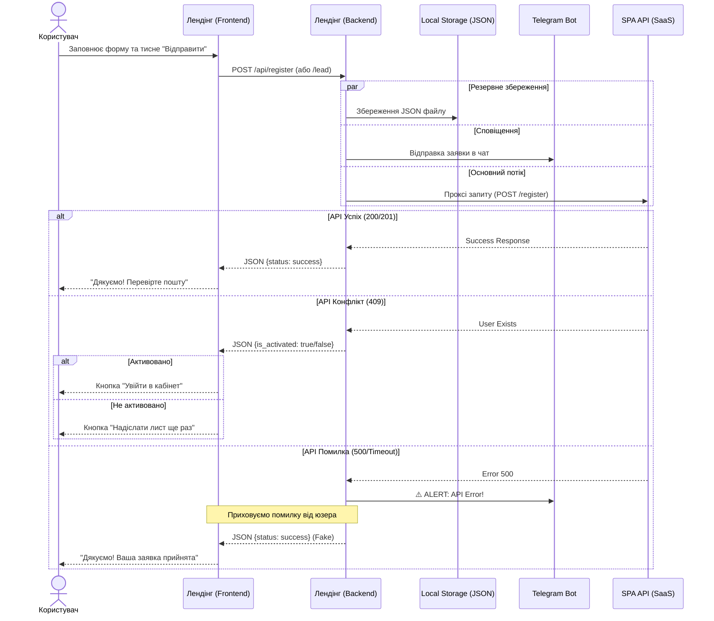

# User Flow: Взаємодія користувача з Лендінгом

Цей документ описує сценарії взаємодії користувача з формами реєстрації та зворотного зв'язку на лендінгу, включаючи обробку помилок та нестандартних ситуацій.

---

## 1. Схема проходження даних (Sequence Diagram)

Ця схема демонструє, як дані рухаються від клієнта до систем зберігання та API, включаючи механізм відмовостійкості.



---

## 2. Логіка інтерфейсу реєстрації (User Journey)

Як інтерфейс адаптується під статус користувача.

```mermaid
graph TD
    Start(Відкриття модалки) --> CheckLS{Є запис в LocalStorage?}
    
    CheckLS -- Так (свіжий) --> ShowSuccess[Екран Успіху]
    CheckLS -- Ні --> ShowForm[Показ Форми]
    
    ShowForm --> InputData[Введення даних]
    InputData --> SaveDraft[Авто-збереження чернетки]
    InputData --> Submit(Натискання "Створити")
    
    Submit --> API_Check{Відповідь API}
    
    API_Check -- 201 Created --> SuccessNew[Успіх: Новий юзер]
    API_Check -- 500 Error --> SuccessNew
    
    API_Check -- 409 Conflict --> IsActive{Активований?}
    
    IsActive -- Так --> ShowLogin[Повідомлення: Вже активовано]
    ShowLogin --> BtnLogin[Кнопка: Увійти]
    
    IsActive -- Ні --> ShowResend[Повідомлення: Вже зареєстровані]
    ShowResend --> BtnResend[Кнопка: Надіслати ще раз]
    
    SuccessNew --> BtnResend
    
    BtnResend --> Timer(Таймер 60 сек)
```

---

## 3. Детальні сценарії

### Сценарій А: Успішна реєстрація (Новий користувач)
1.  Користувач відкриває модальне вікно.
2.  Бачить форму (поля підтягуються динамічно з API).
3.  Заповнює поля (Назва парку, Ім'я, Email, Телефон).
    *   *UX:* Введені дані автоматично зберігаються в `localStorage` (Draft). Якщо закрити і відкрити вікно — дані залишаться.
4.  Натискає "Створити акаунт".
5.  **Система:**
    *   Перевіряє reCAPTCHA v3 (невидимо).
    *   Відправляє дані на бекенд лендінгу -> SPA API.
    *   Зберігає заявку локально (файл) та відправляє в Telegram.
6.  **Результат:**
    *   Форма зникає.
    *   З'являється повідомлення: "Дякуємо! Ваша заявка прийнята. Перевірте пошту".
    *   З'являється кнопка "Надіслати лист ще раз".
    *   Статус успішної реєстрації зберігається в браузері на 24 години.

### Сценарій Б: Користувач вже зареєстрований (але не активований)
1.  Користувач вводить Email, який вже є в базі.
2.  Натискає "Створити акаунт".
3.  **Система:** Отримує відповідь `409 Conflict` від API.
4.  **Результат:**
    *   Повідомлення: "Ви вже зареєстровані. Перевірте пошту".
    *   З'являється кнопка "Надіслати лист ще раз".

### Сценарій В: Користувач вже активований
1.  Користувач вводить Email активного акаунту.
2.  Натискає "Створити акаунт".
3.  **Система:** Отримує відповідь `409 Conflict` з прапорцем `is_activated: true`.
4.  **Результат:**
    *   Повідомлення: "Ваш акаунт вже активовано".
    *   Кнопка "Створити акаунт" зникає.
    *   З'являється кнопка **"Увійти в кабінет"**.
    *   З'являється посилання "Забули пароль?".

### Сценарій Г: Повторний візит (після успішної реєстрації)
1.  Користувач повертається на сайт через годину і знову тисне "Почати роботу".
2.  **Система:** Перевіряє `localStorage`.
3.  **Результат:**
    *   Форма не показується.
    *   Одразу відображається екран успіху ("Ви вже зареєстровані") з кнопкою "Надіслати лист ще раз" або "Увійти" (залежно від збереженого статусу).

### Сценарій Д: Повторна відправка листа (Resend)
1.  Користувач на екрані успіху натискає "Надіслати лист ще раз".
2.  **Система:**
    *   Відправляє запит на `/api/resend`.
    *   Блокує кнопку таймером на 60 секунд.
3.  **Результат:** Повідомлення "Лист відправлено повторно!".

---

## 4. Індивідуальні умови / Enterprise (Сторінка /pricing)

**Точка входу:** Кнопка "Обговорити ідеї" (внизу сторінки).

1.  Користувач відкриває модальне вікно.
2.  **Відмінність:**
    *   Немає вибору тарифу (Monthly/Yearly).
    *   Набір полів інший (Email, Ім'я, Телефон, Повідомлення) — з конфігу `lead`.
    *   Поле `type` автоматично встановлюється в `enterprise`.
3.  Заповнює та відправляє.
4.  **Результат:** Повідомлення про успіх. Кнопки "Надіслати ще раз" немає (бо це не реєстрація акаунту, а заявка менеджеру).

---

## 5. Зворотний зв'язок (Сторінка /contacts)

**Точка входу:** Форма на сторінці контактів.

1.  Користувач бачить форму одразу (не в модалці).
2.  Поля генеруються динамічно (Email, Ім'я, Телефон, Повідомлення).
3.  Поле `type` = `contact`.
4.  **Валідація:**
    *   Якщо ввести некоректний email -> API поверне помилку -> Поле підсвітиться червоним з текстом помилки.
5.  **Результат:**
    *   Форма зникає.
    *   З'являється зелений блок "Повідомлення відправлено".

---

## 6. Обробка помилок (Failover)

### Сценарій: SPA API недоступне (500 Error)
1.  Користувач відправляє будь-яку форму.
2.  Бекенд лендінгу намагається відправити дані на SPA API, але отримує помилку.
3.  **Дії бекенду:**
    *   Зберігає заявку в локальний файл (`storage/leads/`).
    *   Відправляє заявку в Telegram канал.
    *   Відправляє **окреме сповіщення** адміну в Telegram: "⚠️ Помилка SPA API!".
4.  **Результат для користувача:**
    *   Він бачить **"Успіх"** ("Ваша заявка прийнята").
    *   Ми не лякаємо клієнта технічними проблемами, оскільки його контактні дані надійно збережені у нас.

### Сценарій: Покинута форма (Abandoned)
1.  Користувач почав заповнювати форму реєстрації (ввів Email).
2.  Закрив вкладку або перейшов на інший сайт, не натиснувши "Відправити".
3.  **Система:**
    *   Браузер відправляє фоновий запит (`sendBeacon`) на `/api/abandoned`.
    *   Бекенд зберігає дані в `storage/leads/abandoned/`.
    *   Відправляє "тихе" сповіщення в Telegram ("👻 Покинутий лід").
