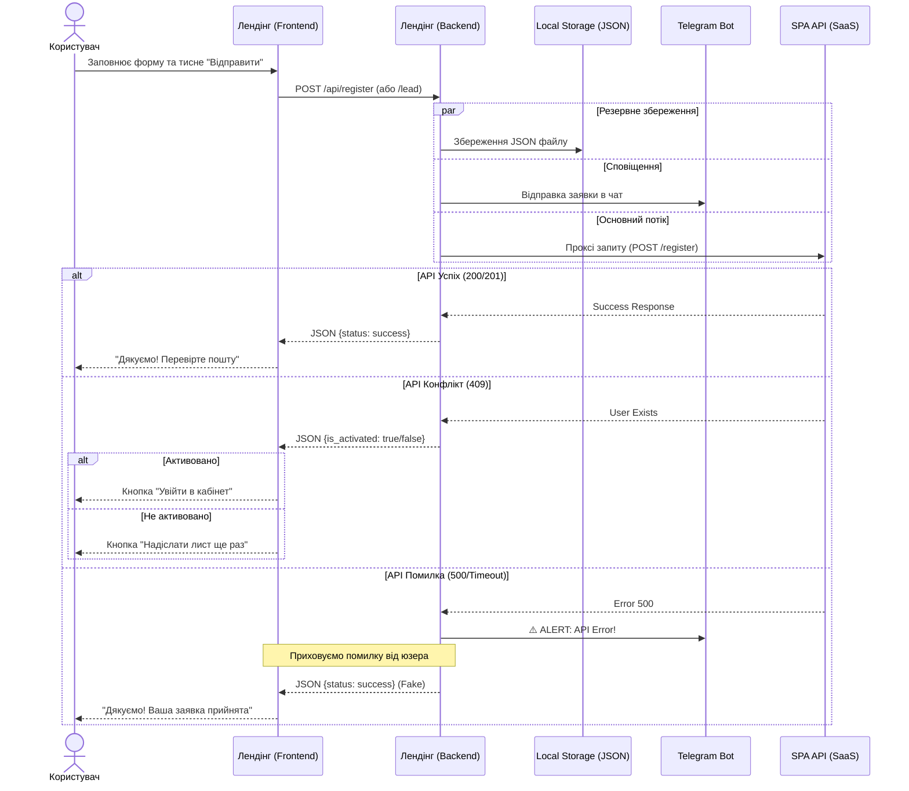

# User Flow: Взаємодія користувача з Лендінгом

Цей документ описує сценарії взаємодії користувача з формами реєстрації та зворотного зв'язку на лендінгу, включаючи логування та обробку помилок.

**Легенда логування:**
*   📄 **Log:** Запис у `storage/logs/app.log`
*   💾 **File:** Створення файлу в `storage/leads/`
*   ✈️ **TG:** Повідомлення в Telegram
*   📊 **DL:** Подія `window.dataLayer` (Frontend)

---

## 1. Схема проходження даних (Sequence Diagram)



---

## 2. Детальні сценарії

### Сценарій А: Успішна реєстрація (Новий користувач)
1.  Користувач відкриває модальне вікно.
    *   📄 **Log:** `GET /api/config` (якщо кеш застарів).
2.  Заповнює поля (Назва парку, Ім'я, Email, Телефон).
    *   *UX:* Введені дані автоматично зберігаються в `localStorage` (Draft).
3.  Натискає "Створити акаунт".
4.  **Система (Backend):**
    *   📄 **Log:** `INFO: Спроба реєстрації (Proxy) {"email": "..."}`
    *   💾 **File:** Створюється файл `storage/leads/register/YYYY-MM-DD_...json` з даними заявки.
    *   ✈️ **TG:** Надсилається повідомлення "🚀 Нова реєстрація парку!".
    *   Відправляє запит на SPA API.
5.  **Система (API Response 201):**
    *   💾 **File:** Оновлюється файл JSON (додається `api_response`).
6.  **Результат (Frontend):**
    *   📊 **DL:** `dataLayer.push({ event: 'lead_generated', type: 'registration' })`
    *   З'являється повідомлення: "Дякуємо! Ваша заявка прийнята".
    *   Зберігається статус в `localStorage` (`g24_registration_state`).

### Сценарій Б: Користувач вже зареєстрований (409 Conflict)
1.  Користувач вводить існуючий Email і тисне "Створити акаунт".
2.  **Система (Backend):**
    *   📄 **Log:** `INFO: Спроба реєстрації...`
    *   💾 **File:** Зберігається заявка.
    *   ✈️ **TG:** Надсилається повідомлення.
    *   SPA API повертає 409.
    *   📄 **Log:** `ERROR: SPA API Error (Register) {"status": 409}`
    *   ✈️ **TG:** Надсилається "⚠️ Помилка SPA API (Register)! Status: 409".
3.  **Результат (Frontend):**
    *   Повідомлення: "Ви вже зареєстровані".
    *   Кнопка змінюється на "Надіслати лист ще раз" або "Увійти".

### Сценарій В: Повторна відправка листа (Resend)
1.  Користувач натискає "Надіслати лист ще раз".
2.  **Система (Backend):**
    *   Відправляє запит на SPA API (`/resend-activation`).
    *   Якщо помилка -> 📄 **Log:** `ERROR: Error in resend`.
3.  **Результат (Frontend):**
    *   Повідомлення "Лист відправлено повторно!".
    *   Таймер на кнопці (60 сек).

### Сценарій Г: Покинута форма (Abandoned)
1.  Користувач ввів Email, але закрив вкладку.
2.  **Система (Frontend):**
    *   Браузер відправляє `navigator.sendBeacon('/api/abandoned')`.
3.  **Система (Backend):**
    *   💾 **File:** Створюється файл `storage/leads/abandoned/...json`.
    *   ✈️ **TG:** Надсилається "👻 Покинутий лід!".

### Сценарій Д: Критична помилка API (500)
1.  Користувач відправляє форму.
2.  SPA API "лежить" (500 Error).
3.  **Система (Backend):**
    *   📄 **Log:** `ERROR: SPA API Error {"status": 500}`
    *   ✈️ **TG:** Надсилається "⚠️ Помилка SPA API! Status: 500".
    *   **Важливо:** Фронтенду повертається `200 OK` (Fake Success).
4.  **Результат (Frontend):**
    *   📊 **DL:** `dataLayer.push({ event: 'lead_generated' })`
    *   Користувач бачить "Успіх". Лід збережено в файлі та Telegram.

---

## 3. Структура логів та файлів

### Лог файл (`storage/logs/app.log`)
```text
[2026-01-28 12:00:00] app.INFO: Отримано нову заявку (Proxy) {"ip":"...", "email":"..."} []
[2026-01-28 12:00:01] app.ERROR: SPA API Error (Lead) {"status":500, "body":"..."} []
```

### JSON файл заявки (`storage/leads/register/...json`)
```json
{
    "park_name": "My Park",
    "owner_email": "test@test.com",
    "saved_at": "2026-01-28 12:00:00",
    "api_response": {
        "status": 201,
        "body": { "success": true }
    }
}
```
