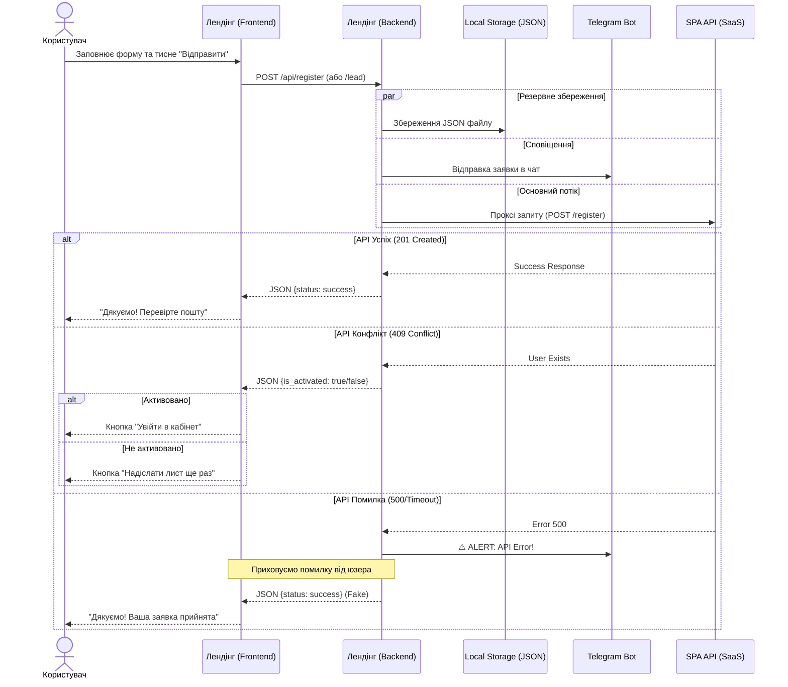

# User Flow: Взаємодія користувача з Лендінгом

Цей документ описує сценарії взаємодії користувача з формами реєстрації та зворотного зв'язку на лендінгу, включаючи логування та обробку помилок.

**Легенда логування:**
*   📄 **Log:** Запис у `storage/logs/app.log`
*   💾 **File:** Створення файлу в `storage/leads/`
*   ✈️ **TG:** Повідомлення в Telegram
*   📊 **DL:** Подія `window.dataLayer` (Frontend)

---

## 1. Схема проходження даних (Sequence Diagram)



---

## 2. Логіка інтерфейсу реєстрації (User Journey)

Як інтерфейс адаптується під статус користувача.

```mermaid
graph TD
    Start(Відкриття модалки) --> CheckDraft{Є Email в чернетці/історії?}
    
    CheckDraft -- Ні --> ShowForm[Показ чистої Форми]
    
    CheckDraft -- Так --> API_CheckStatus[POST /api/check-status]
    
    API_CheckStatus -- Exists: False --> ShowForm
    API_CheckStatus -- Exists: True --> CheckActive{Активований?}
    
    CheckActive -- Так --> ShowLogin[Повідомлення: Вже активовано]
    ShowLogin --> BtnLogin[Кнопка: Увійти]
    
    CheckActive -- Ні --> ShowResend[Повідомлення: Вже зареєстровані]
    ShowResend --> BtnResend[Кнопка: Надіслати ще раз]
    
    ShowForm --> InputData[Введення даних]
    InputData --> SaveDraft[Авто-збереження чернетки]
    InputData --> Submit(Натискання "Створити")
    
    Submit --> API_Register{Відповідь API}
    
    API_Register -- 201 Created --> SuccessNew[Успіх: Новий юзер]
    API_Register -- 409 Conflict --> CheckActive
    
    SuccessNew --> BtnResend
    BtnResend --> Timer(Таймер 60 сек)
```

---

## 3. Детальні сценарії

### Сценарій А: Успішна реєстрація (Новий користувач)
1.  Користувач відкриває модальне вікно.
2.  Бачить чисту форму (або відновлену з чернетки).
3.  Заповнює поля.
    *   *UX:* Введені дані автоматично зберігаються в `localStorage` (Draft).
4.  Натискає "Створити акаунт".
5.  **Система (Backend):**
    *   📄 **Log:** `INFO: Спроба реєстрації...`
    *   💾 **File:** Створюється файл заявки.
    *   ✈️ **TG:** Надсилається повідомлення.
    *   Відправляє запит на SPA API.
6.  **Результат (Frontend):**
    *   📊 **DL:** `dataLayer.push({ event: 'lead_generated' })`
    *   З'являється повідомлення: "Дякуємо! Ваша заявка прийнята".
    *   З'являється кнопка "Надіслати лист ще раз".
    *   В `localStorage` зберігається факт успішної реєстрації.

### Сценарій Б: Користувач вже зареєстрований (409 Conflict)
1.  Користувач вводить існуючий Email і тисне "Створити акаунт".
2.  **Система (Backend):**
    *   SPA API повертає 409.
    *   📄 **Log:** `ERROR: SPA API Error (Register) {"status": 409}`
3.  **Результат (Frontend):**
    *   Повідомлення: "Ви вже зареєстровані. Перевірте пошту".
    *   Кнопка змінюється на "Надіслати лист ще раз".

### Сценарій В: Користувач вже активований
1.  Користувач відкриває модалку (маючи збережений email) АБО вводить email і тисне "Створити".
2.  **Система:** Отримує від API статус `is_activated: true`.
3.  **Результат:**
    *   Повідомлення: "Ваш акаунт вже активовано".
    *   Кнопка **"Увійти в кабінет"**.
    *   Посилання "Забули пароль?".

### Сценарій Г: Повторний візит
1.  Користувач повертається на сайт.
2.  **Система:**
    *   Знаходить email в `localStorage`.
    *   Робить фоновий запит `/api/check-status`.
3.  **Результат:**
    *   Якщо юзер все ще існує -> показується екран успіху (А або В).
    *   Якщо юзера видалили -> показується чиста форма.

### Сценарій Д: Покинута форма (Abandoned)
1.  Користувач ввів Email, але закрив вкладку.
2.  **Система (Frontend):**
    *   Браузер відправляє `navigator.sendBeacon('/api/abandoned')`.
3.  **Система (Backend):**
    *   💾 **File:** Створюється файл `storage/leads/abandoned/...json`.
    *   ✈️ **TG:** Надсилається "👻 Покинутий лід!".
